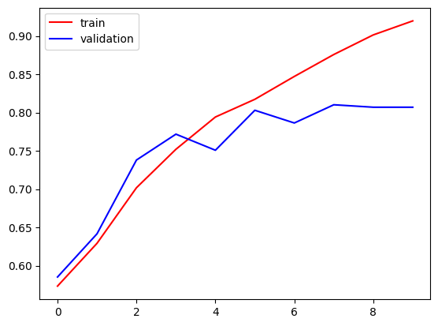

# Cat vs Dog Classifier

## Overview
This project features a Cat vs Dog classifier based on a Convolutional Neural Network (CNN). It effectively differentiates between images of cats and dogs by learning intricate features through multiple layers of neural networks.

**Purpose or motivation**:  
To explore deep learning for image classification, specifically distinguishing between cats and dogs. Potential applications include automated pet identification and image organization tools.

**Datasets used**:  
Trained on the "Dogs vs. Cats" dataset from Kaggle, containing 25,000 images evenly split between cats and dogs.

## Installation
1. **Clone the repository**:
   ```bash
   git clone https://github.com/Himanshu-Goyal18/cat-vs-dog-classifier.git
   cd cat-vs-dog-classifier
   ```
   
2.Requirements
```bash
pip install -r requirements.txt
```

## Inference
To use the Cat vs Dog classifier for inference, follow these steps:

1. **Setup Kaggle API**:
   ```bash
   # Create the Kaggle directory
   mkdir -p ~/.kaggle
   
   # Copy your Kaggle API token to the Kaggle directory
   cp kaggle.json ~/.kaggle/
   ```

2.Download the dataset and set up the environment:
  ```python
# Download the dataset
!kaggle datasets download -d salader/dogs-vs-cats

# Extract the dataset
import zipfile
zip_ref = zipfile.ZipFile('/content/dogs-vs-cats.zip', 'r')
zip_ref.extractall('/content')
zip_ref.close()
```
3.Import necessary libraries:
```python
import tensorflow as tf
from tensorflow import keras
from keras import Sequential
from keras.layers import Dense, Conv2D, MaxPooling2D, Flatten, BatchNormalization, Dropout
```
4.Create generators for training and validation datasets:
```python
train_ds = keras.utils.image_dataset_from_directory(
    directory='/content/train',
    labels='inferred',
    label_mode='int',
    batch_size=32,
    image_size=(256, 256)
)

validation_ds = keras.utils.image_dataset_from_directory(
    directory='/content/test',
    labels='inferred',
    label_mode='int',
    batch_size=32,
    image_size=(256, 256)
)

```
5.Normalize the datasets:
```python
def process(image, label):
    image = tf.cast(image / 255., tf.float32)
    return image, label

train_ds = train_ds.map(process)
validation_ds = validation_ds.map(process)

```
6.Create the CNN model:
```python
model = Sequential()

model.add(Conv2D(32, kernel_size=(3, 3), padding='valid', activation='relu', input_shape=(256, 256, 3)))
model.add(BatchNormalization())
model.add(MaxPooling2D(pool_size=(2, 2), strides=2, padding='valid'))

model.add(Conv2D(64, kernel_size=(3, 3), padding='valid', activation='relu'))
model.add(BatchNormalization())
model.add(MaxPooling2D(pool_size=(2, 2), strides=2, padding='valid'))

model.add(Conv2D(128, kernel_size=(3, 3), padding='valid', activation='relu'))
model.add(BatchNormalization())
model.add(MaxPooling2D(pool_size=(2, 2), strides=2, padding='valid'))

model.add(Flatten())

model.add(Dense(128, activation='relu'))
model.add(Dropout(0.1))
model.add(Dense(64, activation='relu'))
model.add(Dropout(0.1))
model.add(Dense(1, activation='sigmoid'))

model.summary()

model.compile(optimizer='adam', loss='binary_crossentropy', metrics=['accuracy'])

```
7.Train the model:
```python
history = model.fit(train_ds, epochs=10, validation_data=validation_ds)
```

## Evaluate


1.Plot training history:

```python
plt.plot(history.history['accuracy'], color='red', label='train')
plt.plot(history.history['val_accuracy'], color='blue', label='validation')
plt.legend()
plt.show()

```




2.Testing on some new image:

   (a).Resize and reshape image :
   ```python
   import cv2
   test_img = cv2.imread('/content/cat.jpg')
   plt.imshow(test_img)
   test_input = test_img.reshape((1,256,256,3))
   ```


  (b)Print actual image:
   ```python
     plt.imshow(test_img)
   ```
   

  (c)Model Prediction   
  ```python
     x=model.predict(test_input)
     if x<0.5:
        print('Cat')
     else:
        print('Dog')
   ```


### To Do

1. **Improve Model Accuracy**:
   - Experiment with different CNN architectures and hyperparameters to achieve higher accuracy.

2. **Implement Data Augmentation**:
   - Apply augmentation techniques (e.g., rotation, flipping) to enhance model robustness.

3. **Document Code and Results**:
   - Improve code documentation for clarity and include detailed results and metrics from experiments.

4. **Prepare Deployment Strategy**:
   - Plan for deploying the model, considering options like cloud platforms or Docker containers.

5. **Create ReadMe Showcase**:
   - Develop a comprehensive README.md with clear sections for overview, installation, usage, evaluation, and future plans.

6. **Engage with Community**:
   - Share your project on GitHub, participate in discussions, and seek feedback to improve your work.

7. **Prepare for Job Applications**:
   - Highlight key achievements, code quality, and your understanding of deep learning principles in your GitHub repository.

8. **Continuous Learning and Improvement**:
   - Stay updated with the latest developments in deep learning, apply new techniques, and iterate on your model based on feedback.


### Citation


```

Dataset = salader_dogs-vs-cats,
author = {Salader},
title = {Dogs vs. Cats Dataset},
year = {2024},
publisher = {Kaggle},
journal = {Kaggle Dataset},
Published = {https://www.kaggle.com/salader/dogs-vs-cats},

```


     


   
